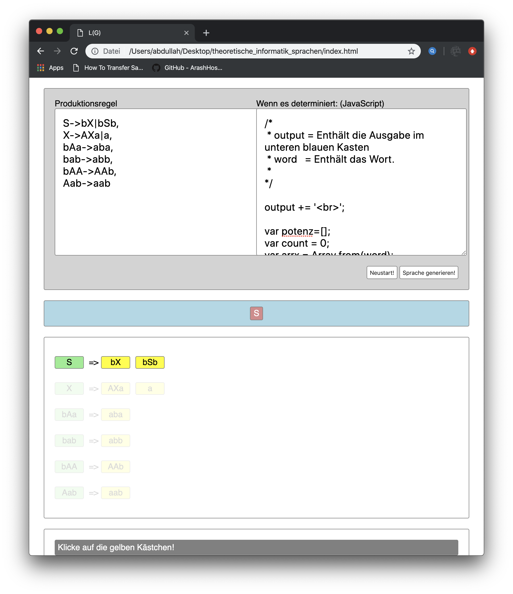
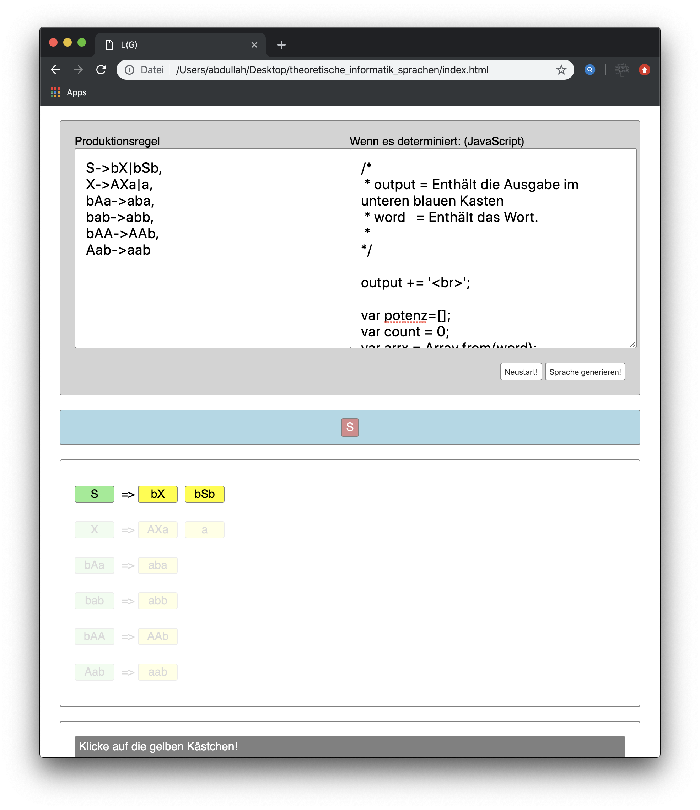
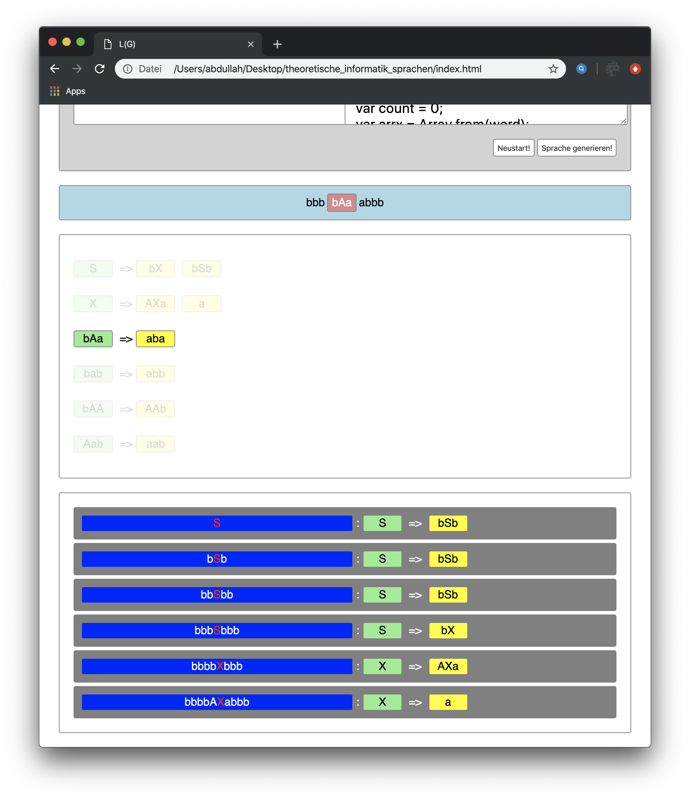
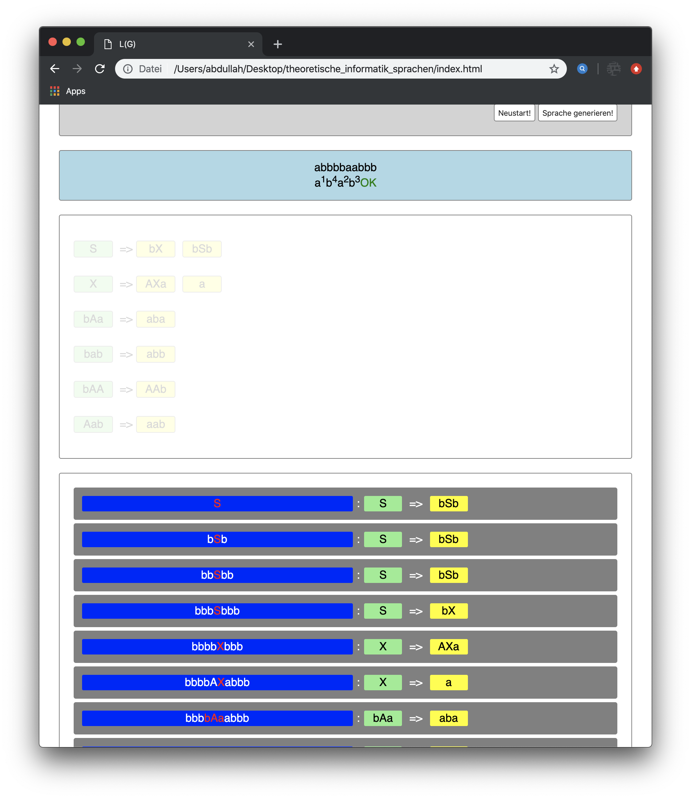

# languange in theoritcal computer science
its self-conscious implemented without third party libaries. its an ugly from scratch coded language processer. 
it is able to process all chmosky hierachy based languages. you're able to define your language & specifing your termination behaviour in javascript. it will display your decision tree/history on the bottom.

# some screenshots:

